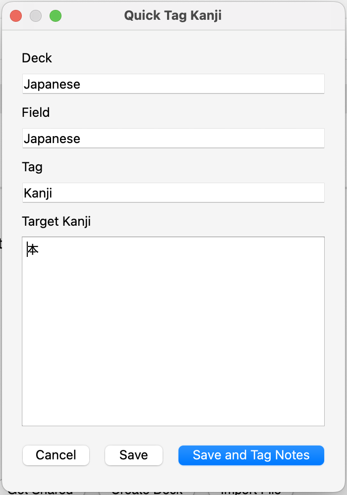

# Anki Kanji Find and Tag

This Anki add-on allows you to bulk tag notes that *only have a certain subset* of kanji. This is mainly useful if you want to practice kanji recall (i.e. writing) without seeing cards that have a mix of kanji you both know and don't know.

## Installation

Install through [AnkiWeb](https://ankiweb.net/shared/info/213436974). This add-on's code is 213436974.

## Usage

Access this add-on through the Tools > Quick Tag Kanji menu.

You can change which deck to bulk tag, which field to inspect for kanji and the tag name to apply as well as list a set of target kanji. Note that non-kanji character are completely ignored but notes with even a single kanji not in this list will not be tagged.

For instance, if your target kanji list is the single kanji 生, a note with "生家" in its target field will not be tagged whereas a note reading "生きる" or "生" will be.
